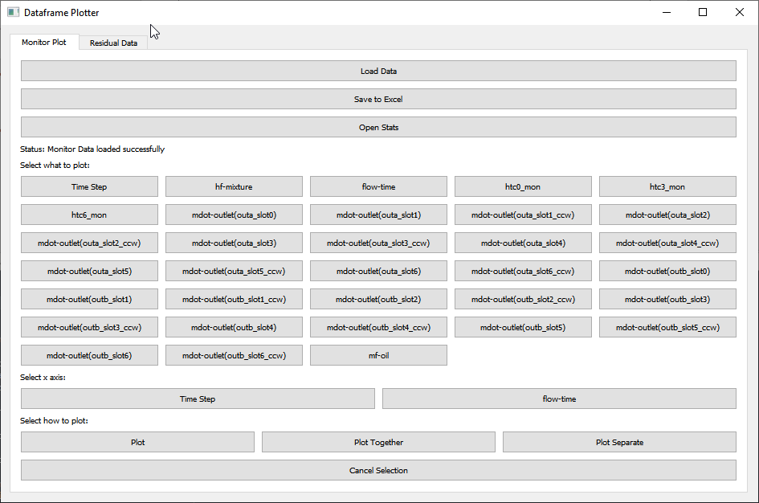
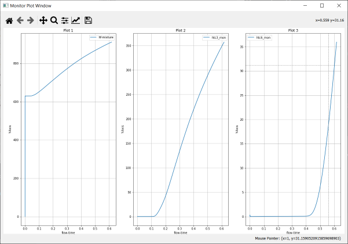
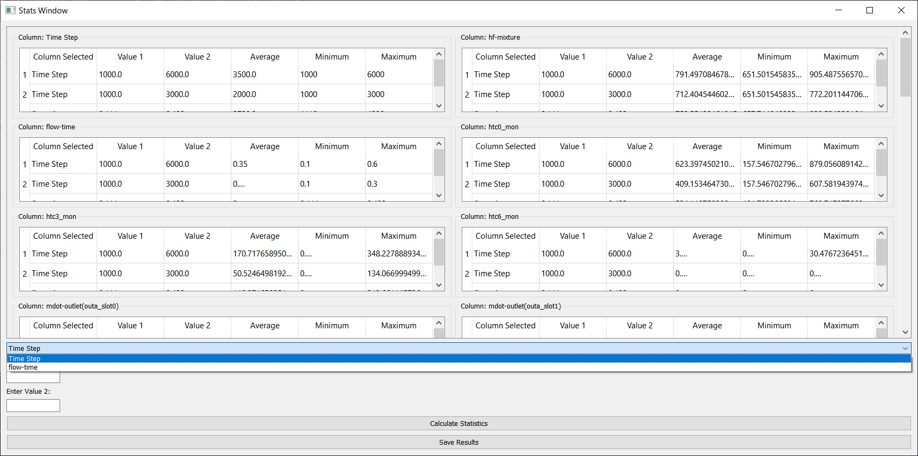

# Fluent Post-Processor

A desktop GUI tool for visualising and analysing ANSYS Fluent simulation output files — built during an internship at **BOSCH Global Software Technologies** (Bangalore, 2023) to eliminate 2–3 hours of manual post-processing per project across the R&D team.

The tool reads raw Fluent output files directly from a simulation working directory, merges data across multiple monitor files, and provides interactive plotting and range-based statistical analysis — all without requiring ANSYS or any Fluent licence.

---

## Features

| Feature | Details |
|---|---|
| **Monitor plot viewer** | Loads all `.out` monitor files in the working directory and merges them on shared time/iteration columns |
| **Residual convergence viewer** | Parses `.o` residual files and plots convergence histories |
| **Three plot modes** | Overlay (all series on one axes), Together (subplot matrix), Separate (one window per series) |
| **Interactive plots** | Scroll to zoom, live crosshair, middle-click to store X reference points |
| **Range statistics** | Select any column as reference, enter a numeric range, compute mean/min/max for every other column within that range |
| **Excel export** | One-click export of any DataFrame or stats table to `.xlsx` |
| **Auto-refresh** | Reloads data from disk every 5 minutes — keep the tool open during a live Fluent run |
| **Standalone executable** | Packaged with PyInstaller; runs on any Windows machine without a Python installation |

---

## Screenshots

| Main window – Monitor tab | Plot window | Stats window |
|---|---|---|
|  |  |  |

---

## Supported File Formats

### Monitor Plot Files — `.out`

ANSYS Fluent writes one `.out` file per monitor (force monitor, surface monitor, etc.).  The tool scans the working directory for all `.out` files and merges them.

**Expected structure:**

```
(title line — ignored)
(description comment — ignored)
("column_name_1" "column_name_2" "column_name_3" ...)
 0.00000e+00   1.23456e-03   7.89012e-04 ...
 1.00000e+00   1.23460e-03   7.89020e-04 ...
 ...
```

- **Line 1–2:** Header comment lines (ignored by the parser)
- **Line 3:** Column names in double-quoted tokens
- **Lines 4+:** Space-separated floating-point data rows

**Typical columns** (varies by monitor type):

| Column | Description |
|---|---|
| `Iteration` | Solver iteration count (steady-state) |
| `Time Step` | Time step index (transient) |
| `flow-time` | Simulated physical time (transient, seconds) |
| `drag-coefficient` / `lift-coefficient` | Aerodynamic force monitors |
| `cd-1`, `cl-1`, … | Indexed force monitor values |
| `mass-flow-rate` | Surface mass flux monitors |
| `area-weighted-average` | Surface average monitors (temperature, pressure, etc.) |
| `volume-average` | Volume integral monitors |

Multiple `.out` files from the same run are outer-merged on their shared time/iteration columns.  Files with no common columns are skipped and reported in the status bar.

---

### Residual Files — `.o<n>`

Fluent writes residual convergence data to a file named `<casename>.o<n>` (e.g. `nozzle.o1`).  Only the first matching file in the directory is loaded.

**Expected structure:**

The file contains a mix of Fluent console output and the residual table.  The parser identifies two patterns:

1. **Header line** — starts with `  iter` followed by residual quantity names:
   ```
     iter  continuity  x-velocity  y-velocity  z-velocity  energy  k  omega  time/iter
   ```
   The last token (`time/iter` or similar) is discarded.

2. **Data rows** — lines where the first 5+ whitespace-delimited tokens are valid floats:
   ```
    1  9.9374e-01  8.2113e-01  6.3771e-01  4.1209e-01  1.0000e+00  ...  0:12:34  250
   ```
   The last two tokens (wall-clock and remaining iterations) are trimmed before storing.

**Typical columns** (varies by physics model):

| Column | Description |
|---|---|
| `iter` | Iteration number |
| `continuity` | Continuity (mass) residual |
| `x-velocity` | X-momentum residual |
| `y-velocity` | Y-momentum residual |
| `z-velocity` | Z-momentum residual (3D) |
| `energy` | Energy equation residual |
| `k` | Turbulent kinetic energy residual (k-ε / k-ω) |
| `epsilon` / `omega` | Turbulent dissipation residual |
| `nut` | Turbulent viscosity residual (Spalart-Allmaras) |

---

## Project Structure

```
fluent-post-processor/
├── main.py                          # Application entry point
├── requirements.txt
├── build_exe.spec                   # PyInstaller packaging config
│
├── fluent_post_processor/
│   ├── __init__.py
│   │
│   ├── data/
│   │   ├── __init__.py
│   │   ├── monitor_dataframe.py     # .out file parser & merger
│   │   └── residual_dataframe.py    # .o file parser
│   │
│   └── gui/
│       ├── __init__.py
│       ├── main_window.py           # Application window & tab controller
│       ├── plot_utility.py          # Scroll-zoom, crosshair, click mixin
│       ├── monitor_plot_window.py   # Plot window for monitor data
│       ├── residual_plot_window.py  # Plot window for residual data
│       └── stats_window.py          # Range-based statistics window
│
└── assets/
    └── screenshots/                 # Add your own screenshots here
```

---

## Getting Started

### Prerequisites

- Python 3.9+
- ANSYS Fluent (only needed to generate the input files — not needed to run this tool)

### Installation

```bash
git clone https://github.com/<your-username>/fluent-post-processor.git
cd fluent-post-processor
pip install -r requirements.txt
```

### Running

Navigate to your Fluent simulation working directory (the folder that contains your `.out` and `.o` files), then run:

```bash
python /path/to/fluent-post-processor/main.py
```

Or copy `main.py` and the `fluent_post_processor/` package into your simulation directory.

The tool loads data from the **current working directory** on startup and auto-refreshes every 5 minutes.

---

## Building a Standalone Executable

The tool can be packaged as a self-contained Windows executable using PyInstaller, so it can be distributed and run on machines without a Python installation.

```bash
pip install pyinstaller
pyinstaller build_exe.spec
```

Output: `dist/FluentPostProcessor/FluentPostProcessor.exe`

Copy the entire `dist/FluentPostProcessor/` folder to your target machine.  Run `FluentPostProcessor.exe` from inside the simulation directory.

---

## Usage Guide

### Loading Data

Click **Load Data** on either tab.  The tool scans the current working directory for `.out` files (Monitor tab) and `.o<n>` files (Residual tab) and loads them automatically.

Data reloads automatically every 5 minutes.  Open plot windows update in place — useful when monitoring a running simulation.

### Plotting

1. **Select Y columns** — toggle the checkable buttons (one per column). Multiple selections are allowed.
2. **Select X axis** — choose one of `Iteration`, `Time Step`, or `flow-time` for monitor plots; `iter` for residuals.
3. **Choose plot mode:**
   - **Plot (overlay)** — all Y series on one shared axes
   - **Plot Together** — each Y series in its own subplot, arranged in a grid
   - **Plot Separate** — each Y series in its own window

**Plot window interactions:**

| Gesture | Action |
|---|---|
| Scroll wheel | Zoom in / out centred on cursor |
| Mouse move | Live crosshair overlay + coordinate readout |
| Middle-click | Store an X reference value (up to 2 points) |
| Right-click | Clear stored X reference values |
| Toolbar | Pan, zoom box, save figure (standard Matplotlib toolbar) |

### Statistics

Click **Open Stats** to open the statistics window for the loaded DataFrame.

1. Select a reference column (e.g. `Iteration`) from the dropdown.
2. Enter a lower and upper bound.
3. Click **Calculate Statistics** — mean, min, and max are computed for every column within the specified range and added to the respective group box table.
4. Repeat with different ranges to compare; results accumulate in the table.
5. Click **Save Results** to export all calculated statistics to Excel.

### Excel Export

Click **Save to Excel** on either tab to write the full merged DataFrame to:

```
<working_directory>/Fluent_Post_Processing_Files/monitor_dataframe.xlsx
<working_directory>/Fluent_Post_Processing_Files/residual_dataframe.xlsx
```

---

## Background

This tool was built as part of a data analytics and automation internship at **BOSCH Global Software Technologies** in summer 2023.  The original brief was to optimise an existing post-processing script for one specific project.  The scope expanded into a full desktop application after it became clear that the R&D team was spending 2–3 hours per project on repetitive manual steps — exporting CSVs from Fluent, reformatting them in Excel, and generating plots by hand.

The original version was a single 1,000+ line Python file — the first Python script the author had ever written.  This repository is a refactored, modularised version of that original, with the monolithic file broken into focused modules, documented, and packaged for easier reuse.

The packaged executable was adopted across the R&D team for the remainder of the internship.

---

## Dependencies

| Package | Purpose |
|---|---|
| `PyQt5` | GUI framework |
| `matplotlib` | Plotting with interactive backends |
| `pandas` | DataFrame operations and Excel export |
| `openpyxl` | `.xlsx` write support (pandas backend) |

---

## Licence

MIT — free to use, modify, and distribute.
